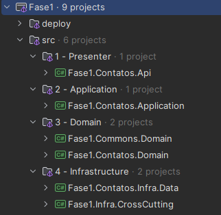

# API de Contatos ☎️
Este projeto é parte da entrega da atividade prática do curso de Arquitetura de Sistemas .NET com Azure. O objetivo é criar uma API de Contatos utilizando .NET com os testes de unidade necessários.

## Tecnologias Utilizadas 🧑‍💻
- .NET 8
- Entity Framework Core
- Docker
- PostgreSQL
- xUnit

## Arquitetura 🏛️
A arquitetura do projeto foi baseada na abordagem do DDD (Domain Driven Design) e Clean Architecture. A estrutura do projeto foi dividida em camadas, sendo elas:

### Presenter 
- **Fase1.Contatos.Api**: Camada de apresentação da aplicação, responsável por receber as requisições HTTP e retornar as respostas.

### Application 
- **Fase1.Contatos.Application**: Camada de aplicação, responsável por orquestrar as chamadas aos métodos de repositório e realizar as validações necessárias.

### Domain 
- **Fase1.Contatos.Domain**: Camada de domínio, responsável por armazenar as entidades e interfaces de repositório.
- **Fase1.Commons.Domain**: Camada de compartilhamento, responsável por armazenar classes e métodos que são compartilhados entre as demais camadas.

### Infraestrutura
- **Fase1.Contatos.Infra.Data**: Camada de infraestrutura, responsável por implementar as interfaces de repositório e realizar a comunicação com o banco de dados.

## Overview da arquitetura 🗃️



## Testes 🧪
Os testes unitários foram implementados utilizando a biblioteca xUnit. Para executar os testes, basta executar o comando `dotnet test` na raiz do projeto.

### Cobertura de Testes 🤗
A cobertura de testes foi de 78% dos métodos da aplicação, de acordo com o dotCover. Um relatório detalhado pode ser encontrado na pasta `coverage`.

## Executando a aplicação 🚀

### Requisitos
- .NET 8
- Docker

### Passo a passo

1 - Na raíz do projeto execute o seguinte comando:
```bash
docker compose -f .\deploy\docker-compose.yaml -p fase1 up -d --build
```
Esse comando irá fazer o build da aplicação e subir o container com a aplicação e o banco de dados.

2 - Utilize o comando a baixo para atualizar a base de dados com as migrations:
```bash
dotnet ef database update -p .\src\Fase1.Contatos.Infra.Data\Fase1.Contatos.Infra.Data.csproj -s .\src\Fase1.Contatos.Api\Fase1.Contatos.Api.csproj -c ContatoDbContext
```
Pronto! A aplicação está pronta para ser utilizada.